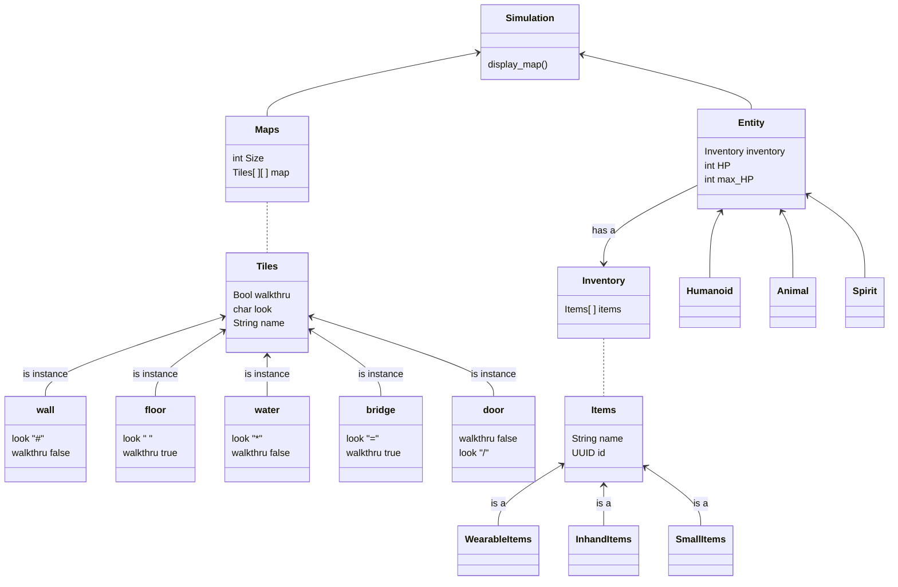

```mermaid
classDiagram

    class Simulation
    Simulation : display_map()

    Simulation <-- Maps
    Simulation <-- Entity

		Maps .. Tiles
		Maps : int Size
		Maps : Tiles[ ][ ] map

			Tiles : Bool walkthru
			Tiles : char look
			Tiles : String name

			Tiles <-- wall : is instance
			Tiles <-- floor : is instance
			Tiles <-- water : is instance
			Tiles <-- bridge : is instance
			Tiles <-- door : is instance

				wall : look "#"
				wall : walkthru false

				floor : look " "
				floor : walkthru true

				water : look "*"
				water : walkthru false

				bridge : look "="
				bridge : walkthru true

				door : walkthru false
				door : look "/"

		Entity --> Inventory : has a
		Entity : Inventory inventory
		Entity : int HP
		Entity : int max_HP

		Entity <-- Humanoid
		Entity <-- Animal
		Entity <-- Spirit

			Inventory .. Items
			Inventory : Items[ ] items

				Items : String name
				Items : UUID id

				Items <-- WearableItems : is a
				Items <-- InhandItems : is a
				Items <-- SmallItems : is a

```
