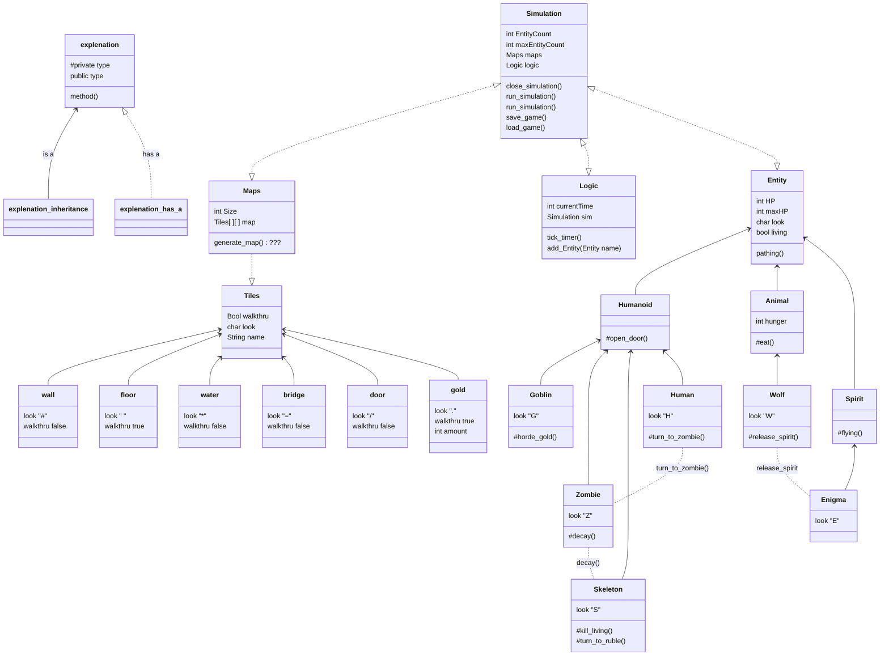

```mermaid
classDiagram
	class explenation
	explenation : #private type
	explenation: public type
	explenation : method()
	explenation <-- explenation_inheritance : is a 
	explenation <|.. explenation_has_a : has a

    class Simulation
	Simulation : int EntityCount
	Simulation : int maxEntityCount
    Simulation : close_simulation()
	Simulation : run_simulation()
	Simulation : run_simulation()
	Simulation : save_game()
	Simulation : load_game()
	Simulation : Maps maps
	Simulation : Logic logic

    Simulation <|..|> Maps
	Simulation <|..|> Logic
    Simulation <|..|> Entity

		Logic : int currentTime
		Logic : tick_timer()
		Logic : Simulation sim
		Logic : add_Entity(Entity name)

		Maps ..|> Tiles
		Maps : int Size
		Maps : generate_map()???
		Maps : Tiles[ ][ ] map

			Tiles : Bool walkthru
			Tiles : char look
			Tiles : String name

			Tiles <-- wall
			Tiles <-- floor
			Tiles <-- water
			Tiles <-- bridge
			Tiles <-- door
			Tiles <-- gold

				wall : look "#"
				wall : walkthru false

				floor : look " "
				floor : walkthru true

				water : look "*"
				water : walkthru false

				bridge : look "="
				bridge : walkthru false

				door : look "/"
				door : walkthru false

				gold : look "."
				gold : walkthru true
				gold : int amount

		Entity : int HP
		Entity : int maxHP
		Entity : char look
		Entity : bool living
		Entity : pathing()

		Entity <-- Humanoid
		Entity <-- Animal
		Entity <-- Spirit

			Humanoid <-- Goblin
			Humanoid <-- Zombie
			Humanoid <-- Skeleton
			Humanoid <-- Human
			Humanoid : #open_door()

				Human .. Zombie : turn_to_zombie()
				Human : #turn_to_zombie()
				Human : look "H"

				Goblin : #horde_gold()
				Goblin: look "G"

				Zombie .. Skeleton : decay()
				Zombie : #decay()
				Zombie : look "Z"

				Skeleton : #kill_living()
				Skeleton : #turn_to_ruble()
				Skeleton : look "S"

			Animal <-- Wolf
			Animal : int hunger
			Animal : #eat()

				Wolf .. Enigma : release_spirit
				Wolf : #release_spirit()
				Wolf : look "W"

			Spirit <-- Enigma
			Spirit : #flying()

				Enigma : look "E"
```
