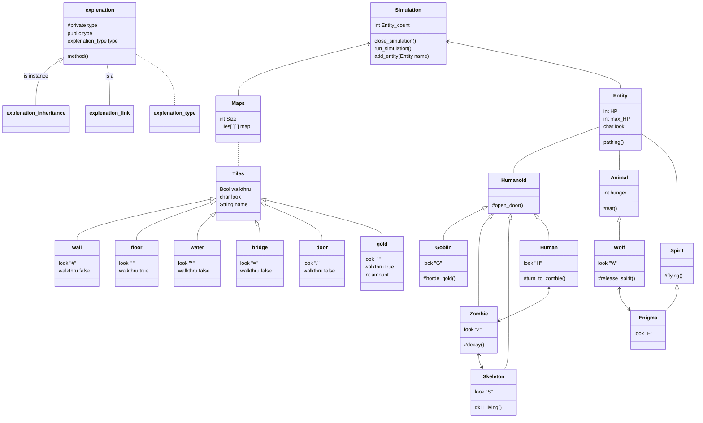

```mermaid
classDiagram
	class explenation
	explenation : #private type
	explenation: public type
	explenation : method()
	explenation <|-- explenation_inheritance : is instance 
	explenation -- explenation_link : is a
	explenation : explenation_type type
	explenation .. explenation_type 

    class Simulation
	Simulation : int Entity_count
    Simulation : close_simulation()
	Simulation : run_simulation()
	Simulation : add_entity(Entity name)

    Simulation <-- Maps
    Simulation <-- Entity

		Maps .. Tiles
		Maps : int Size
		Maps : Tiles[ ][ ] map

			Tiles : Bool walkthru
			Tiles : char look
			Tiles : String name

			Tiles <|-- wall
			Tiles <|-- floor
			Tiles <|-- water
			Tiles <|-- bridge
			Tiles <|-- door
			Tiles <|-- gold

				wall : look "#"
				wall : walkthru false

				floor : look " "
				floor : walkthru true

				water : look "*"
				water : walkthru false

				bridge : look "="
				bridge : walkthru false

				door : look "/"
				door : walkthru false

				gold : look "."
				gold : walkthru true
				gold : int amount

		Entity : int HP
		Entity : int max_HP
		Entity : char look
		Entity : pathing()

		Entity -- Humanoid
		Entity -- Animal
		Entity -- Spirit

			Humanoid <|-- Goblin
			Humanoid <|-- Zombie
			Humanoid <|-- Skeleton
			Humanoid <|-- Human
			Humanoid : #open_door()

				Human <--> Zombie
				Human : #turn_to_zombie()
				Human : look "H"

				Goblin : #horde_gold()
				Goblin: look "G"

				Zombie <--> Skeleton
				Zombie : #decay()
				Zombie : look "Z"

				Skeleton : #kill_living()
				Skeleton : look "S"

			Animal <|-- Wolf
			Animal : int hunger
			Animal : #eat()

				Wolf <--> Enigma
				Wolf : #release_spirit()
				Wolf : look "W"

			Spirit <|-- Enigma
			Spirit : #flying()

				Enigma : look "E"
```
