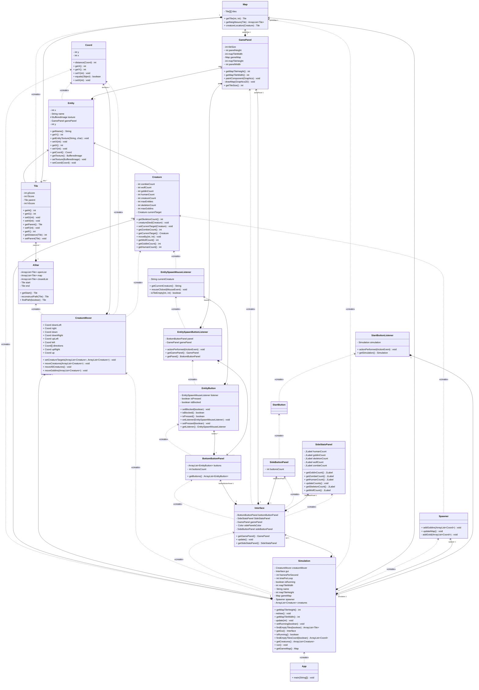

```mermaid
classDiagram
direction BT
class AStar {
  - ArrayList~Tile~ openList
  - ArrayList~Tile~ map
  - ArrayList~Tile~ closedList
  - Tile start
  - Tile end
  + getStart() Tile
  - reconstructPath(Tile) Tile
  + findPath(boolean) Tile
}
class App {
  + main(String[]) void
}
class BottomButtonPanel {
  - ArrayList~EntityButton~ buttons
  ~ int buttonsCount
  + getButtons() ArrayList~EntityButton~
}
class Coord {
  - int y
  - int x
  + distance(Coord) int
  + getX() int
  + getY() int
  + setY(int) void
  + equals(Object) boolean
  + setX(int) void
}
class Creature {
  - int zombieCount
  - int wolfCount
  - int goblinCount
  - int humanCount
  - int creatureCount
  - int maxEntities
  - int skeletonCount
  - int maxGoblins
  - Creature currentTarget
  + getSkeletonCount() int
  + creatureDied(Creature) void
  + setCurrentTarget(Creature) void
  + getZombieCount() int
  + getCurrentTarget() Creature
  + moveBy(int, int) void
  + getWolfCount() int
  + getGoblinCount() int
  + getHumanCount() int
}
class CreatureMover {
  + Coord downLeft
  + Coord right
  + Coord down
  + Coord downRight
  + Coord upLeft
  + Coord left
  + Coord[] directions
  + Coord upRight
  + Coord up
  + setCreatureTargets(ArrayList~Creature~, ArrayList~Creature~) void
  + moveCreatures(ArrayList~Creature~) void
  + moveAllCreatures() void
  + moveGoblins(ArrayList~Creature~) void
}
class Entity {
  - int x
  - String name
  # BufferedImage texture
  - GamePanel gamePanel
  - int y
  + getName() String
  + getY() int
  + getEntityTexture(String, char) void
  + setX(int) void
  + getX() int
  + setY(int) void
  + getCoord() Coord
  + getTexture() BufferedImage
  + setTexture(BufferedImage) void
  + setCoord(Coord) void
}
class EntityButton {
  - EntitySpawnMouseListener listener
  - boolean isPressed
  - boolean isBlocked
  + setBlocked(boolean) void
  + isBlocked() boolean
  + isPressed() boolean
  + setListener(EntitySpawnMouseListener) void
  + setPressed(boolean) void
  + getListener() EntitySpawnMouseListener
}
class EntitySpawnButtonListener {
  - BottomButtonPanel panel
  - GamePanel gamePanel
  + actionPerformed(ActionEvent) void
  + getGamePanel() GamePanel
  + getPanel() BottomButtonPanel
}
class EntitySpawnMouseListener {
  - String currentCreature
  + getCurrentCreature() String
  + mouseClicked(MouseEvent) void
  - isTileEmpty(int, int) boolean
}
class GamePanel {
  - int tileSize
  ~ int panelHeight
  - int mapTileWidth
  - Map gameMap
  - int mapTileHeight
  ~ int panelWidth
  + getMapTileHeight() int
  + getMapTileWidth() int
  + paintComponent(Graphics) void
  - drawMap(Graphics2D) void
  + getTileSize() int
}
class Interface {
  - BottomButtonPanel bottomButtonPanel
  - SideStatsPanel SideStatsPanel
  - GamePanel gamePanel
  ~ Color sidePanelsColor
  - SideButtonPanel sideButtonPanel
  + getGamePanel() GamePanel
  + update() void
  + getSideStatsPanel() SideStatsPanel
}
class Map {
  - Tile[][] tiles
  + getTile(int, int) Tile
  + getNeighbours(Tile) ArrayList~Tile~
  + creatureLocation(Creature) Tile
}
class SideButtonPanel {
  ~ int buttonsCount
}
class SideStatsPanel {
  - JLabel humanCount
  - JLabel goblinCount
  - JLabel skeletonCount
  - JLabel wolfCount
  - JLabel zombieCount
  + getGoblinCount() JLabel
  + getZombieCount() JLabel
  + getHumanCount() JLabel
  + updateCounts() void
  + getSkeletonCount() JLabel
  + getWolfCount() JLabel
}
class Simulation {
  - CreatureMover creatureMover
  - Interface gui
  ~ int framesPerSecond
  ~ int timePerLoop
  - boolean isRunning
  - int mapTileWidth
  ~ String name
  - int mapTileHeight
  - Map gameMap
  - Spawner spawner
  - ArrayList~Creature~ creatures
  + getMapTileHeight() int
  - redraw() void
  + getMapTileWidth() int
  - update(int) void
  + setRunning(boolean) void
  + findEmptyTiles(boolean) ArrayList~Tile~
  + getGui() Interface
  + isRunning() boolean
  + findEmptyTilesCoord(boolean) ArrayList~Coord~
  + getCreatures() ArrayList~Creature~
  + run() void
  + getGameMap() Map
}
class Spawner {
  + addGoblins(ArrayList~Coord~) void
  + updateMap() void
  - addGold(ArrayList~Coord~) void
}
class StartButton
class StartButtonListener {
  - Simulation simulation
  + actionPerformed(ActionEvent) void
  + getSimulation() Simulation
}
class Tile {
  - int gScore
  - int fScore
  - Tile parent
  - int hScore
  + getH() int
  + getG() int
  + setG(int) void
  + setH(int) void
  + getParent() Tile
  + setF(int) void
  + getF() int
  + getDistance(Tile) int
  + setParent(Tile) void
}

AStar "1" *--> "openList *" Tile 
App  ..>  Simulation : «create»
BottomButtonPanel  ..>  EntityButton : «create»
BottomButtonPanel "1" *--> "buttons *" EntityButton 
Creature  -->  Entity 
CreatureMover  ..>  AStar : «create»
CreatureMover "1" *--> "directions *" Coord 
CreatureMover  ..>  Coord : «create»
CreatureMover  ..>  Creature : «create»
Entity  ..>  Coord : «create»
Entity "1" *--> "gamePanel 1" GamePanel 
EntityButton  ..>  EntitySpawnButtonListener : «create»
EntityButton "1" *--> "listener 1" EntitySpawnMouseListener 
EntitySpawnButtonListener "1" *--> "panel 1" BottomButtonPanel 
EntitySpawnButtonListener  ..>  EntitySpawnMouseListener : «create»
EntitySpawnButtonListener "1" *--> "gamePanel 1" GamePanel 
EntitySpawnMouseListener  ..>  Creature : «create»
GamePanel "1" *--> "gameMap 1" Map 
Interface  ..>  BottomButtonPanel : «create»
Interface "1" *--> "bottomButtonPanel 1" BottomButtonPanel 
Interface  ..>  GamePanel : «create»
Interface "1" *--> "gamePanel 1" GamePanel 
Interface "1" *--> "sideButtonPanel 1" SideButtonPanel 
Interface  ..>  SideButtonPanel : «create»
Interface "1" *--> "SideStatsPanel 1" SideStatsPanel 
Interface  ..>  SideStatsPanel : «create»
Map  ..>  Tile : «create»
Map "1" *--> "tiles *" Tile 
SideButtonPanel  ..>  StartButton : «create»
Simulation  ..>  Coord : «create»
Simulation "1" *--> "creatures *" Creature 
Simulation "1" *--> "creatureMover 1" CreatureMover 
Simulation  ..>  CreatureMover : «create»
Simulation  ..>  Interface : «create»
Simulation "1" *--> "gui 1" Interface 
Simulation  ..>  Map : «create»
Simulation "1" *--> "gameMap 1" Map 
Simulation  ..>  Spawner : «create»
Simulation "1" *--> "spawner 1" Spawner 
Spawner  ..>  Creature : «create»
StartButton  ..>  StartButtonListener : «create»
StartButtonListener "1" *--> "simulation 1" Simulation 
Tile  -->  Entity 
```